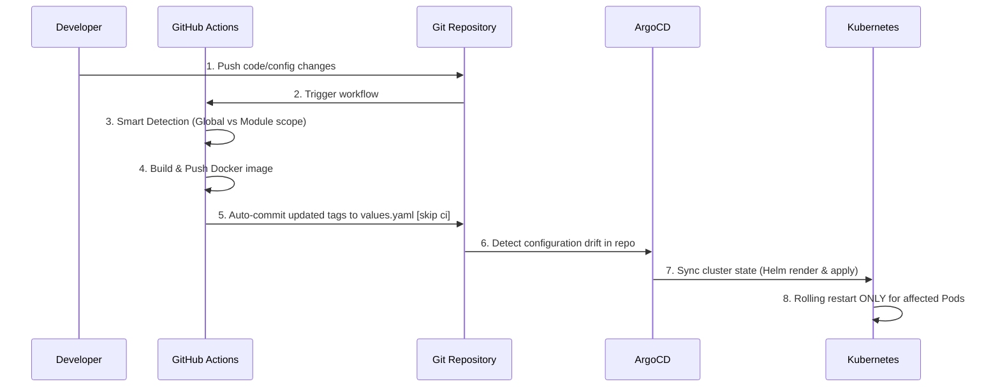

# k8s-dynamic-workers-monorepo
A Kubernetes and OpenShift-oriented ETL worker orchestration project built around selective restarts. The design focuses on detecting configuration changes for a specific worker and restarting only the affected deployment instead of triggering a full application-wide rollout. The project adopts a monorepo approach, housing both application code and infrastructure manifests (e.g., Helm charts) in a single repository. 
**The **core design principle** is that all workers share the same underlying application codebase, relying on environment variables to dictate their specific ETL behavior."** Additionally, the project strictly follows **GitOps methodology (via ArgoCD)**, ensuring secure, pull-based cluster synchronization without exposing cluster credentials to the CI pipeline.

## 1. Key features
* **Change Detection** - A GitHub Actions workflow identifies exactly which configuration files were modified and uses this data to trigger targeted updates
* **Selective Reload** - A configuration change in one worker doesn't force a global rollout. Only deployments directly affected by the committed changes are restarted, ensuring **zero downtime** for the rest of the ETL pipelines.
* **GitOps-Driven Deployments** - By leveraging **ArgoCD**, the project employs a secure, pull-based deployment strategy. The CI pipeline only builds the images and updates the Helm values in the repository, while ArgoCD automatically synchronizes the cluster state.
* **Secure & DynamicSecrets** - Secrets management is decoupled from the CI/CD pipeline. Through integration with **Stakater Reloader**, worker Pods are automatically restarted the moment their underlying credentials (e.g., in K8s Secrets or Vault) are rotated..
* **Single Image Architecture** - All workers utilize a single, shared container image. This drastically reduces CI/CD build times, saves container registry space, and simplifies image management.
* **Independent Scalability** - Because each worker is deployed as a separate Kubernetes Deployment (managed via Helm), they can be scaled independently based on their specific workload requirements.

## 2. Project structure
```text
├── .github
|     └── workflows
|           └── build-and-push.yml
├── Containerfile
├── Helm-Chart
|     ├── Chart.yaml
|     ├── templates
|     |     ├── configmap.yaml
|     |     └── deployment.yaml
|     └── values.yaml
├── README.md
├── src
|     ├── main.py
|     └── queries
|           ├── __init__.py
|           ├── mysql.py
|           ├── oracle.py
|           └── postgres.py
```

## 3. How It Works
The architecture is built around the decoupling of application logic and worker configuration, paired with a modern GitOps pipeline. Instead of maintaining separate codebases for different ETL jobs, the system utilizes a **Single Image, Multiple Configurations** paradigm and tracks changes at the module level.

### Architecture Diagram


### The CI/CD & Deployment Flow
1. **Smart Change Detection:** Upon a ```git push```, the GitHub Actions workflow analyzes the commit payload. It uses a dynamic detection script with two modes:
   * **Global Scope:** If core files are changed (```Containerfile```, ```requirements.txt```, or ```src/main.py```), the pipeline rebuilds and updates the tags for all workers.
   * **Module Scope:** If a specific query file is changed (e.g., ```src/queries/mysql.py```), the pipeline identifies the affected ```dbType``` and isolates the update.
2. **Automated GitOps Commit:** The CI/CD pipeline builds the container image and tags it with the Git short SHA. To maintain a strict GitOps flow, the workflow uses ```sed``` to update the specific image tags inside ```Helm-Chart/values.yaml``` and commits the changes back to the ```master``` branch. The CI/CD pipeline does not interact with the Kubernetes cluster directly.
3. **ArgoCD Synchronization:** ArgoCD continuously monitors the repository. Once it detects the automated commit from GitHub Actions, it initiates a sync process, rendering the Helm chart with the newly updated ```values.yaml```.
4. **Targeted Release & Checksums:** When ArgoCD applies the updated manifests to the cluster, the ```deployment.yaml``` calculates a unique hash for each worker's configuration:
```checksum/config: {{ toJson $config | sha256sum }}```.
Because only the modified worker's tag was updated, only its checksum changes.
5. **Selective Pod Restart:** Kubernetes detects the modified annotation in the specific Deployment and orchestrates a rolling restart. Unaffected workers (whose checksums remain unchanged) continue running with zero downtime.
6. **Secret-Driven Reloads:** The deployments utilize Stakater Reloader annotations (```secret.reloader.stakater.com/reload```). If underlying credentials in Kubernetes Secrets or HashiCorp Vault are rotated, only the Pods utilizing those specific secrets will automatically restart to pick up the new variables.

## 4. Prerequisities
To successfully deploy and run this project, the following infrastructure and tools must be present and configured.

### Infrastructure & Cluster
* **Kubernetes / OpenShift Cluster:** A working cluster (e.g., K3s, Minikube, or a managed cloud K8s/OpenShift environment).
* **Helm 3.x:** Required for rendering and managing the Kubernetes manifests.
* **ArgoCD:** Installed on the cluster and configured to monitor this Git repository for GitOps synchronization.
* **Stakater Reloader:** Installed on the cluster to enable automatic Pod restarts upon Secret/ConfigMap modifications.

### CI/CD & Repository Secrets
* **GitHub Actions Runner:** A runner capable of executing Docker Buildx commands (e.g., the `k3s-monorepo-runner` referenced in the workflow).
* **Container Registry:** An accessible registry (local or remote) to store the built ETL images.
* **GitHub Secrets:** The repository requires the following secret to be configured for the GitHub Actions workflow to succeed:
  * `LOCAL_REGISTRY_URL` - The URL of your target container registry.
    
## 5. Configuration
The core application behavior and worker orchestration are defined declaratively via the Helm chart's `values.yaml` file. Because all workers share the same codebase, adding a new ETL pipeline is as simple as defining a new worker block in this file.
### Defining a Worker

To add a new worker, append a new configuration block under the `workers` dictionary. Here is an example:

```yaml
workers:
  etl-omega:
    repository: "etl-monorepo-app"
    dbType: "postgres"
    tag: "8a9b0c1" 
    secretEnv:
      BKTNAME:
        secretName: "etl-secret-shared-postgres"
        secretKey: "bucket"
      DB_PASSWORD:
        secretName: "etl-secret-shared-postgres"
        secretKey: "db-password"
```
### Configuration Parameters
| Parameter | Description |
| --- | --- |
|```workers.<name>```|The unique identifier for the worker (e.g., ```etl-omega```). This dictates the name of the generated K8s Deployment, ConfigMap, and Pod labels.|
|```reppository```|The name of the container image repository to pull from.|
|```dbType```|The target database engine (e.g., ```mysql```, ```postgres```, ```oracle```). This value is injected as the ```WORKER_TYPE``` environment variable and dictates which python module in ```src/queries/``` is executed.|
|```tag```|The specific image tag (Git SHA) to deploy. ⚠️ Note: During standard GitOps workflows, this field is updated automatically by the GitHub Actions pipeline. Manual changes should only be made for emergency rollbacks.|
|```secretEnv```|A dictionary defining environment variables sourced from Kubernetes Secrets. It requires mapping the desired env variable name (e.g., ```DB_PASSWORD```) to an existing ```secretName``` and ```secretKey```.|
### Secrets Management
This project assumes that the Secrets referenced in ```secretEnv``` already exist in the cluster namespace before deployment. Thanks to the integrated Stakater Reloader, if the underlying values in these Secrets are updated, the corresponding worker Pods will automatically restart to inherit the new credentials.

## 6. Deployment
Because this project adheres to **GitOps** principles, day-to-day deployments are handled automatically. You do not need to run manual `kubectl` or `helm` commands to deploy application updates.

### Initial Cluster Setup (ArgoCD)

To deploy the orchestrator to your cluster, create an ArgoCD `Application` resource that points to this repository. You can apply the following manifest to your cluster (adjusting the `repoURL` and `destination` as needed):

```yaml
apiVersion: argoproj.io/v1alpha1
kind: Application
metadata:
  name: etl-monorepo-workers
  namespace: argocd
spec:
  project: default
  source:
    repoURL: '[https://github.com/your-org/k8s-dynamic-workers-monorepo.git](https://github.com/your-org/k8s-dynamic-workers-monorepo.git)'
    targetRevision: master
    path: Helm-Chart
  destination:
    server: '[https://kubernetes.default.svc](https://kubernetes.default.svc)'
    namespace: etl-workers
  syncPolicy:
    automated:
      prune: true
      selfHeal: true
```
Once applied, ArgoCD will continuously monitor the ```Helm-Chart/values.yaml``` file on the ```master``` branch and synchronize the Kubernetes cluster state automatically.

## 7. CI/CD Pipeline
The Continuous Integration and Continuous Deployment (CI/CD) process is fully automated via GitHub Actions (```build-and-push.yml```). It is designed to be highly efficient, building and deploying only what is necessary based on the commit footprint.
### Workflow Triggers
The workflow executes on pushes to the ```master``` branch, specifically monitoring:
* Application logic (```src/```)
* Container definitions (```Containerfile```)
* Dependencies (```requirements.txt```)
### Pipeline Stages
1. **Change Detection (Smart Routing)**
A custom bash script analyzes the git diff to determine the scope of the change:
    * **Global Scope:** If structural files (```Containerfile```, ```requirements.txt```, or ```src/main.py```) are modified, the script marks all database workers (MySQL, Oracle, Postgres) for an update.
    * **Module Scope:** If only a specific query file is modified (e.g., ```src/queries/mysql.py```), the script isolates the build matrix to target only the ```mysql``` worker.
2. **Build and Push (Docker Buildx):**
Using the generated matrix, the pipeline builds the unified container image using Kubernetes-driven Docker Buildx runners. The image is tagged with the short Git SHA and pushed to the configured container registry.
3. **GitOps Auto-Commit:**
Instead of pushing changes directly to the cluster, the workflow acts as a GitOps agent. It uses ```sed``` to find the exact worker blocks in ```Helm-Chart/values.yaml``` that correspond to the modified modules and updates their ```tag``` fields with the new Git SHA. It then commits and pushes these changes directly back to the ```master``` branch with a ```[skip ci]``` flag to prevent infinite workflow loops.

This approach guarantees that the Git repository remains the single source of truth for both application code and cluster state.
