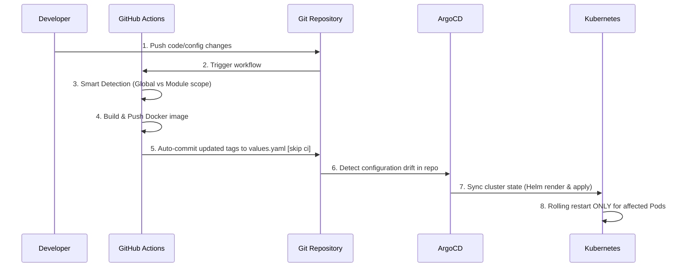

# k8s-dynamic-workers-monorepo
A Kubernetes and OpenShift-oriented ETL worker orchestration project built around selective restarts. The design focuses on detecting configuration changes for a specific worker and restarting only the affected deployment instead of triggering a full application-wide rollout. The project adopts a monorepo approach, housing both application code and infrastructure manifests (e.g., Helm charts) in a single repository. 
**The **core design principle** is that all workers share the same underlying application codebase, relying on environment variables to dictate their specific ETL behavior."** Additionally, the project strictly follows **GitOps methodology (via ArgoCD)**, ensuring secure, pull-based cluster synchronization without exposing cluster credentials to the CI pipeline.

## Key features
* **Change Detection** - A GitHub Actions workflow identifies exactly which configuration files were modified and uses this data to trigger targeted updates
* **Selective Reload** - A configuration change in one worker doesn't force a global rollout. Only deployments directly affected by the committed changes are restarted, ensuring **zero downtime** for the rest of the ETL pipelines.
* **GitOps-Driven Deployments** - By leveraging **ArgoCD**, the project employs a secure, pull-based deployment strategy. The CI pipeline only builds the images and updates the Helm values in the repository, while ArgoCD automatically synchronizes the cluster state.
* **Secure & DynamicSecrets** - Secrets management is decoupled from the CI/CD pipeline. Through integration with **Stakater Reloader**, worker Pods are automatically restarted the moment their underlying credentials (e.g., in K8s Secrets or Vault) are rotated..
* **Single Image Architecture** - All workers utilize a single, shared container image. This drastically reduces CI/CD build times, saves container registry space, and simplifies image management.
* **Independent Scalability** - Because each worker is deployed as a separate Kubernetes Deployment (managed via Helm), they can be scaled independently based on their specific workload requirements.

## Project structure
```text
├── .github
|     └── workflows
|           └── build-and-push.yml
├── Containerfile
├── Helm-Chart
|     ├── Chart.yaml
|     ├── templates
|     |     ├── configmap.yaml
|     |     └── deployment.yaml
|     └── values.yaml
├── README.md
├── src
|     ├── main.py
|     └── queries
|           ├── __init__.py
|           ├── mysql.py
|           ├── oracle.py
|           └── postgres.py
```

## How It Works
The architecture is built around the decoupling of application logic and worker configuration, paired with a modern GitOps pipeline. Instead of maintaining separate codebases for different ETL jobs, the system utilizes a **Single Image, Multiple Configurations** paradigm and tracks changes at the module level.

### Architecture Diagram


### The CI/CD & Deployment Flow
1. **Smart Change Detection:** Upon a ```git push```, the GitHub Actions workflow analyzes the commit payload. It uses a dynamic detection script with two modes:
   * **Global Scope:** If core files are changed (```Containerfile```, ```requirements.txt```, or ```src/main.py```), the pipeline rebuilds and updates the tags for all workers.
   * **Module Scope:** If a specific query file is changed (e.g., ```src/queries/mysql.py```), the pipeline identifies the affected ```dbType``` and isolates the update.
2. **Automated GitOps Commit:** The CI/CD pipeline builds the container image and tags it with the Git short SHA. To maintain a strict GitOps flow, the workflow uses ```sed``` to update the specific image tags inside ```Helm-Chart/values.yaml``` and commits the changes back to the ```master``` branch. The CI/CD pipeline does not interact with the Kubernetes cluster directly.
3. **ArgoCD Synchronization:** ArgoCD continuously monitors the repository. Once it detects the automated commit from GitHub Actions, it initiates a sync process, rendering the Helm chart with the newly updated ```values.yaml```.
4. **Targeted Release & Checksums:** When ArgoCD applies the updated manifests to the cluster, the ```deployment.yaml``` calculates a unique hash for each worker's configuration:
```checksum/config: {{ toJson $config | sha256sum }}```.
Because only the modified worker's tag was updated, only its checksum changes.
5. **Selective Pod Restart:** Kubernetes detects the modified annotation in the specific Deployment and orchestrates a rolling restart. Unaffected workers (whose checksums remain unchanged) continue running with zero downtime.
6. **Secret-Driven Reloads:** The deployments utilize Stakater Reloader annotations (```secret.reloader.stakater.com/reload```). If underlying credentials in Kubernetes Secrets or HashiCorp Vault are rotated, only the Pods utilizing those specific secrets will automatically restart to pick up the new variables.

## Prerequisities

## Configuration

## Deployment

## CI/CD Pipeline
